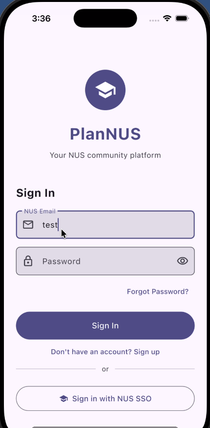
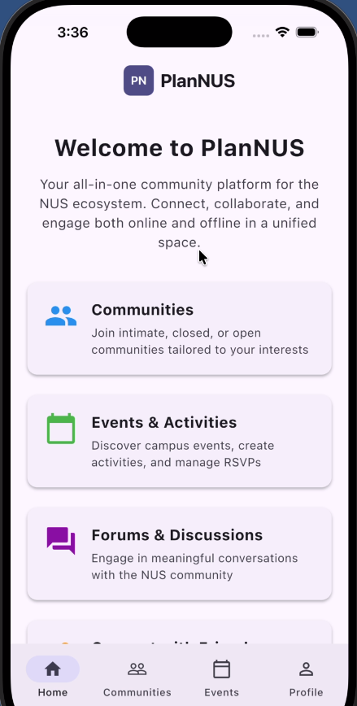

# Team MonoSodium-Glutamate
Orbital 25/26
# 📅 PlanNUS


> A modern scheduling and planning application built to help users manage their time effectively. 

## ✨ Features

* **Interactive Calendar:** Seamless date selection and event visualization using `table_calendar`.
* **Real-time Sync:** Cloud database and authentication powered by Supabase.
* **Reactive UI:** Predictable and scalable state management utilizing Riverpod.
* **Cross-Platform:** Beautiful and responsive design compiled natively for iOS and Android.

## 🛠 Tech Stack

* **Framework:** [Flutter](https://flutter.dev/)
* **State Management:** [Riverpod](https://riverpod.dev/) (`flutter_riverpod`)
* **Backend & Database:** [Supabase](https://supabase.com/) (`supabase_flutter`)
* **UI Components:** `table_calendar`, `cupertino_icons`

## 🚀 Getting Started (Will change if is based on a server)

To get a copy of the project up and running on your local machine _(for now)_ for development and testing.

### Prerequisites

Ensure the following are installed on your local computer:
* [Flutter SDK](https://docs.flutter.dev/get-started/install) (Version `3.11.5` or higher)
* [Dart SDK](https://dart.dev/get-dart)
* A [Supabase](https://supabase.com/) account and project setup.

### 1. Clone the repository

Access the GitHub repository and clone it to your local desktop. Avoid saving it in any location where OneDrive is active as Flutter does not like files that are synced.

You can run the following commands in your prefered terminal after 'cd'ing into the folder you want to clone it to. 

```bash
git clone https://github.com/ys-243/MonoSodium-Glutamate.git
```

### 2. Install Dependencies
Fetch all the packages defined in the pubspec.yaml.

```bash
flutter pub get
```

...TBD

## App Demo

<video src="./readmephotos/Demonstration of PlanNUS.mov" controls width="100%"></video>


## How to use

First, sign in using your NUS email and password.

<p align="center">
  
</p>

Once logged in, you will reach the home page.

<p align="center">
  
</p>

### 1. Home Page
